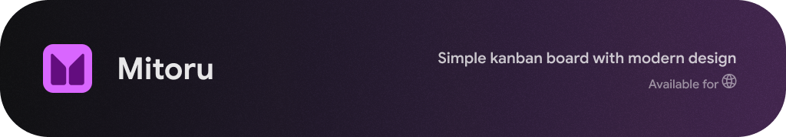

Simple kanban board with modern design

---

Open source, designed for individuals and available in web

> [!TIP]
> The static website is availale at **[mitoru.immorrtalz.com](https://mitoru.immorrtalz.com)**, the data is stored in your `localStorage`

> [!NOTE]
> This app uses `Web Crypto API`, which requires a secure context (HTTPS or localhost).

> [!NOTE]
> This project was called "Mitoru" (from japanese みとる (見取る) "to perceive", to understand", "to observe") since kanban is a special form of representing information in a convenient, easily understandable way.

## Repository structure
### Branches

[`main`](https://github.com/immorrtalz/Mitoru/tree/main) – stable version

[`dev`](https://github.com/immorrtalz/Mitoru/tree/dev) – development, something might not work

[`prod`](https://github.com/immorrtalz/Mitoru/tree/prod) – static website deploy source, usually the latest version from the [`main`](https://github.com/immorrtalz/Mitoru/tree/main)

---

Font "Google Sans" - Copyright © Google LLC (https://fonts.google.com/specimen/Google+Sans)